# Technical Portfolio
> Infrastructure Operations | Security Defense | Automation & Systems Integration

---

## I. Enterprise Infrastructure & Hybrid Cloud Architecture

| 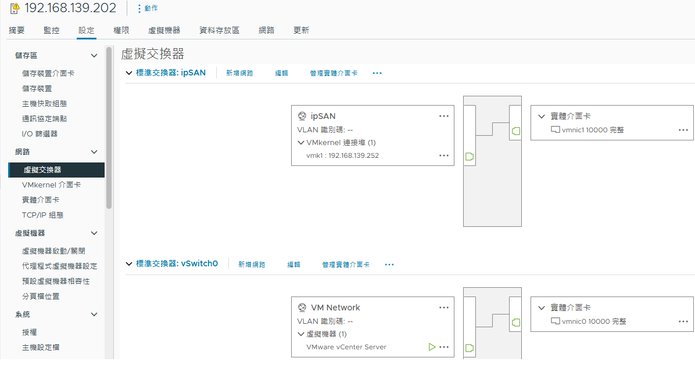 | 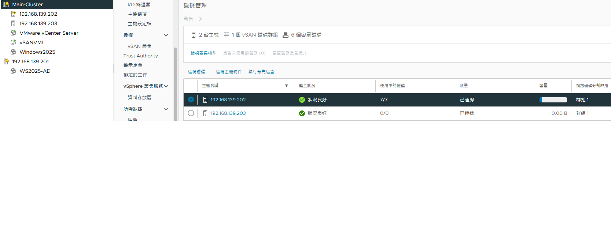 |
| :--- | :--- |
| **Cloud Network & 10G Backbone** L2/L3 Network isolation, 10G Backbone/ipSAN traffic segmentation. | **vSAN Cluster Configuration** HCI cluster deployment and storage policy management. |

| 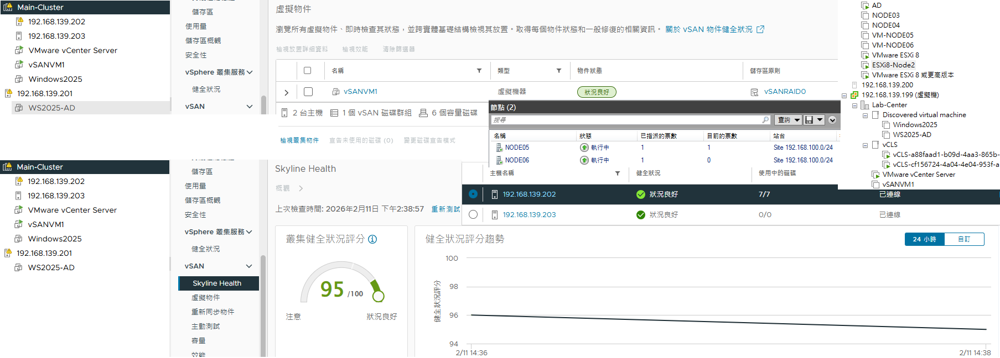 | 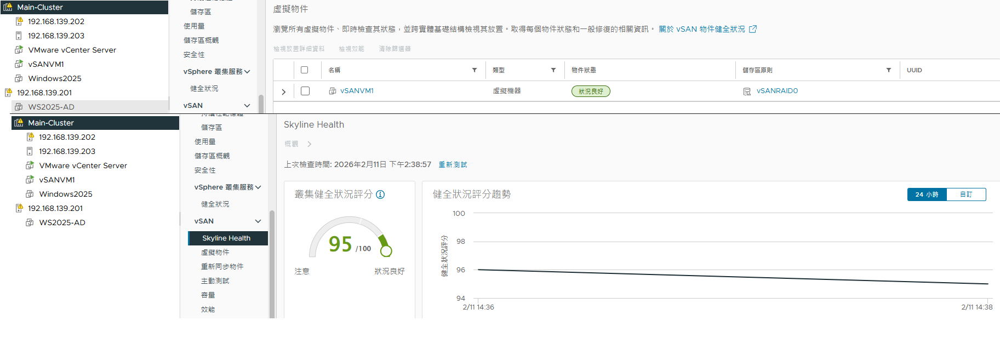 |
| :--- | :--- |
| **Enterprise Virtualization & vSAN** Large-scale virtualization deployment and storage cluster maintenance. | **Skyline Health & vSAN Audit** Proactive health monitoring and automated infrastructure auditing. |

---

## II. Industrial Automation & Monitoring Systems

| 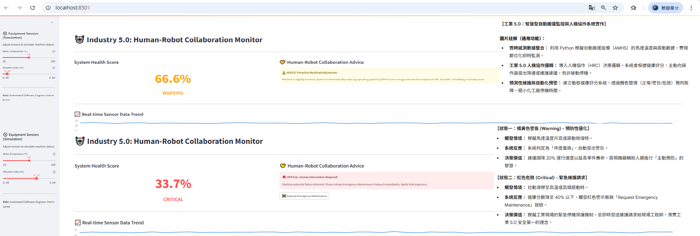 | 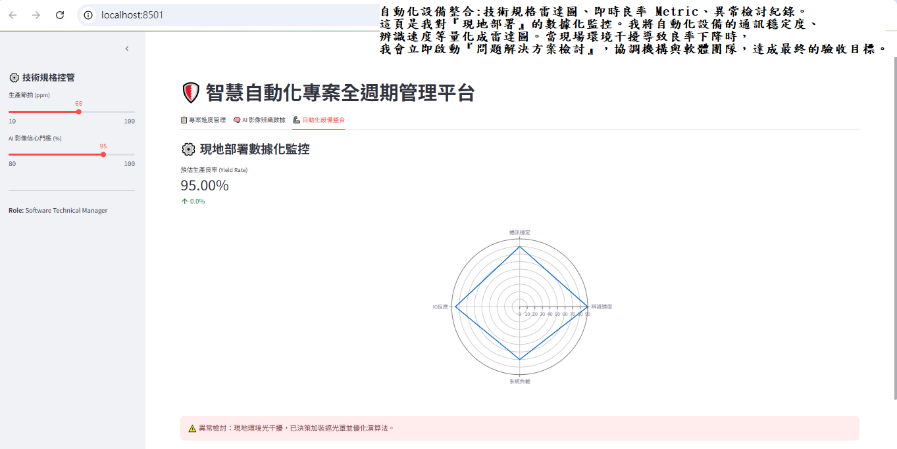 |
| :--- | :--- |
| **Smart AGV & Human-Machine Collaboration** Industry 5.0 implementation and AGV/HMI system integration. | **Integrated Device Monitoring** Real-time hardware status aggregation and on-site decision logic. |

| .png) | 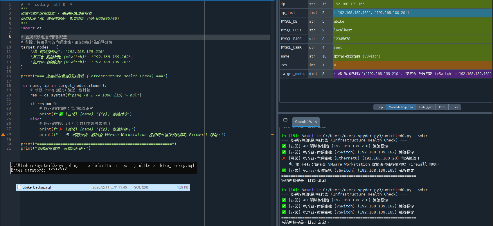 |
| :--- | :--- |
| **Cross-Segment Health Check** Automated health checks across multiple network segments. | **Integrated Monitoring & Backup** Centralized monitoring with integrated backup protocols. |

---

## III. Automation Development & Technical Management

| 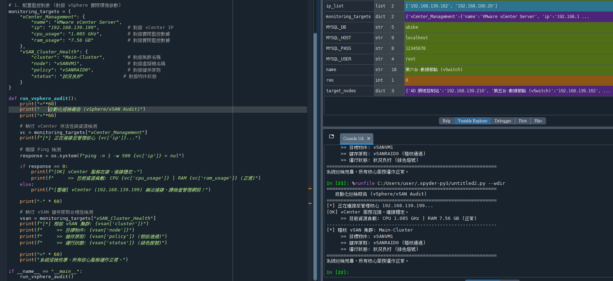 | 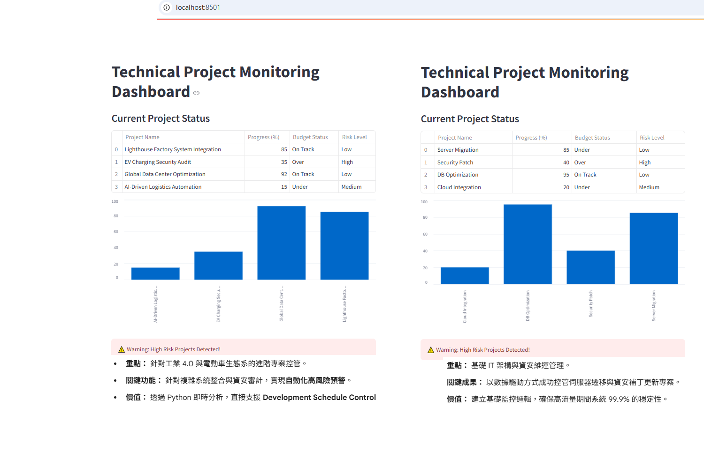 |
| :--- | :--- |
| **vSphere/vSAN Automation Script** Automated log analysis via vCenter API / Python. | **Technical Project Management** Strategic monitoring and technical SDLC execution. |

| 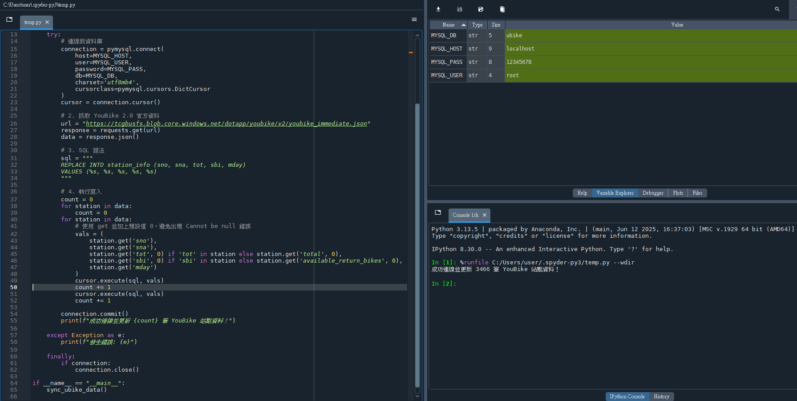 | 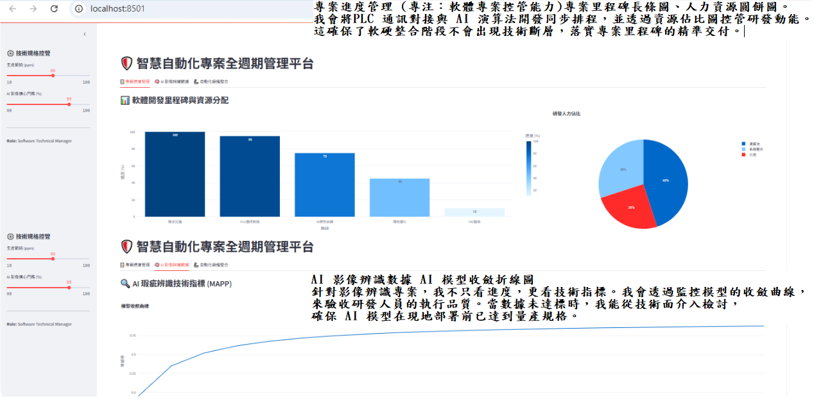 |
| :--- | :--- |
| **YouBike API Integration** High-concurrency data processing and ETL logic verification. | **SDLC & AI Recognition Monitoring** Milestone tracking integrated with AI-driven monitoring. |

---

## IV. Database Integrity & Disaster Recovery (DR)

|  | .png) |
| :--- | :--- |
| **Database Architecture** Schema design, normalization, and data integrity verification. | **Disaster Recovery (DR) SOP** Business Continuity Planning (BCP) and recovery protocol execution. |
