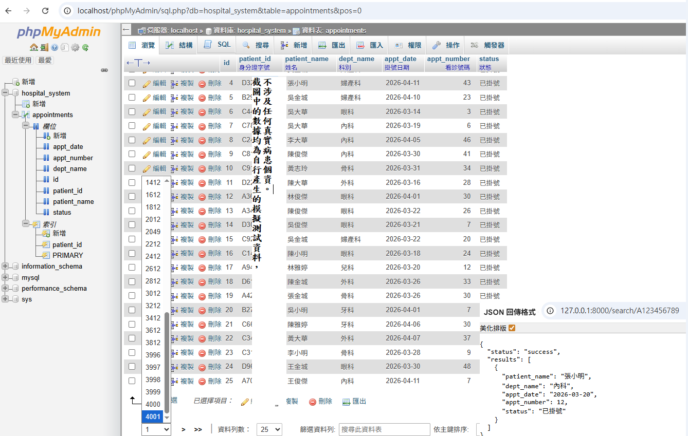

# Technical Portfolio
> Infrastructure Operations | Security Defense | Automation & Systems Integration

  
  
  

---

## I. Enterprise Infrastructure & Hybrid Cloud Architecture

### Cloud Network & 10G Backbone

### vSAN Cluster Configuration

### Enterprise Virtualization & vSAN Maintenance

### vSAN Skyline Health & Audit

---

## II. Industrial Automation & Monitoring Systems

### Industry 5.0: Smart AGV & HMI Collaboration

### Integrated Device Monitoring & Decision Support

### Integrated Monitoring & Database Backup

### Cross-Segment Health Check (Automated)
.png)

---

## III. Automation Development & Technical Management

### Database Architecture & Schema Design

### vSphere/vSAN Automation Scripting

### Technical Project Management & Strategy

### YouBike API Integration & ETL

### SDLC & AI Recognition Monitoring

